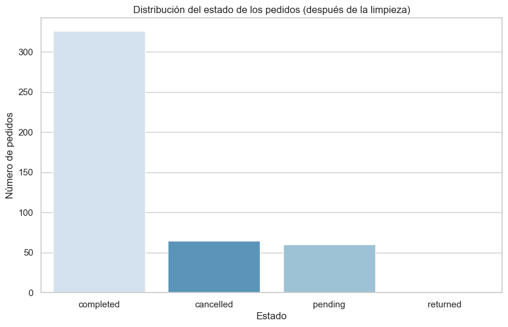
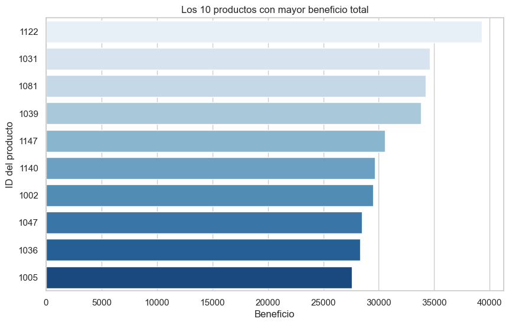

```python
import numpy as np
import pandas as pd
import matplotlib.pyplot as plt
import seaborn as sns

sns.set_theme(style="whitegrid")
plt.rcParams['figure.figsize'] = (10, 6)
```


```python
customers = pd.read_csv('customers.csv')
products = pd.read_csv('products.csv')
orders = pd.read_csv('orders.csv')
order_items = pd.read_csv('order_items.csv')

print(f"Customers: {customers.shape}, Products: {products.shape}, Orders: {orders.shape}, Order_items: {order_items.shape}")
```

    Customers: (357, 4), Products: (155, 4), Orders: (456, 4), Order_items: (914, 4)
    


```python
customers = customers.drop_duplicates(subset=['customer_id'], keep='first')

customers = customers.dropna(subset=['customer_id'])

customers['email'] = customers['email'].str.strip().str.lower()
valid_email_regex = r'^[\w\.-]+@[\w\.-]+\.\w+$'
is_valid_email = customers['email'].str.match(valid_email_regex, na=False)
customers.loc[~is_valid_email, 'email'] = 'unknown'

print(f"Tamaño de los clientes después de la limpieza: {customers.shape}")
```

    Tamaño de los clientes después de la limpieza: (353, 4)
    


```python
products = products.drop_duplicates(subset=['product_id'], keep='first')
products = products.dropna(subset=['product_id'])

products = products[products['price'] > 0]

print(f"Tamaño de los productos después de la limpieza: {products.shape}")
```

    Tamaño de los productos después de la limpieza: (152, 4)
    


```python
orders = orders.drop_duplicates(subset=['order_id'], keep='first')
orders = orders.dropna(subset=['order_id'])

orders['created_at'] = pd.to_datetime(orders['created_at'], errors='coerce')
orders = orders.dropna(subset=['created_at'])

orders['order_status'] = orders['order_status'].str.strip().str.lower()

orders = orders[orders['customer_id'].isin(customers['customer_id'])]

print(f"Tamaño de los pedidos después de la limpieza: {orders.shape}")
```

    Tamaño de los pedidos después de la limpieza: (452, 4)
    


```python
order_items = order_items.dropna(subset=['order_id', 'product_id'])

order_items = order_items[order_items['quantity'] > 0]

order_items = order_items[order_items['order_id'].isin(orders['order_id'])]
order_items = order_items[order_items['product_id'].isin(products['product_id'])]

print(f"Tamaño de los artículos del pedido después de la limpieza: {order_items.shape}")
```

    Tamaño de los artículos del pedido después de la limpieza: (907, 4)
    


```python
merged_data = order_items.merge(products, on='product_id', how='inner')
merged_data = merged_data.merge(orders, on='order_id', how='inner')

merged_data['total_revenue'] = merged_data['quantity'] * merged_data['price']

plt.figure()
sns.countplot(data=orders, x='order_status', order=orders['order_status'].value_counts().index, palette='Blues', hue='order_status', legend=False)
plt.title('Distribución del estado de los pedidos (después de la limpieza)')
plt.xlabel('Estado')
plt.ylabel('Número de pedidos')
plt.show()

top_products = merged_data.groupby('product_id')['total_revenue'].sum().reset_index()
top_products = top_products.sort_values(by='total_revenue', ascending=False).head(10)

top_products['product_id'] = top_products['product_id'].astype(str)

plt.figure()
sns.barplot(data=top_products, x='total_revenue', y='product_id', palette='Blues', hue='product_id', legend=False)
plt.title('Los 10 productos con mayor beneficio total')
plt.xlabel('Beneficio')
plt.ylabel('ID del producto')
plt.show()
```


    

    


    

    

