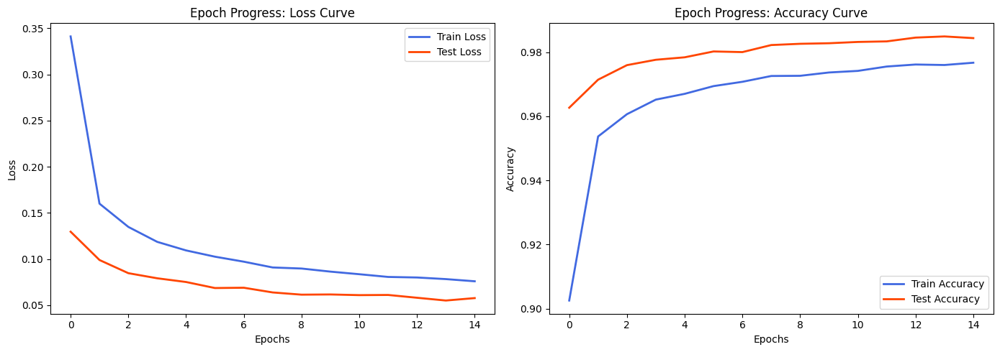
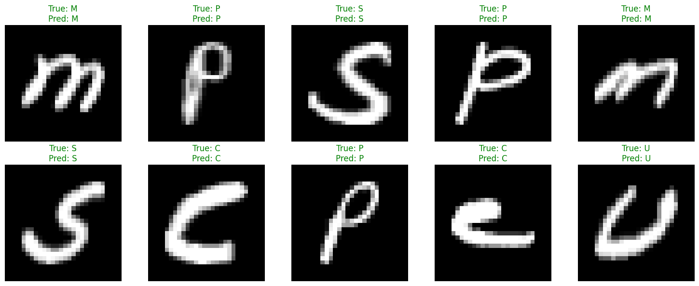

```python
import numpy as np
import pandas as pd
import matplotlib.pyplot as plt
import torch
import torch.nn as nn
import torch.optim as optim
from torch.utils.data import Dataset, DataLoader, random_split

torch.manual_seed(42)
np.random.seed(42)
```


```python
class AlphabetDataset(Dataset):
    def __init__(self, csv_file):
        df = pd.read_csv(csv_file)
        self.labels = df.iloc[:, 0].values
        self.images = df.iloc[:, 1:].values / 255.0

    def __len__(self):
        return len(self.labels)

    def __getitem__(self, idx):
        image = torch.tensor(self.images[idx], dtype=torch.float32)
        label = torch.tensor(self.labels[idx], dtype=torch.long)
        return image, label

dataset = AlphabetDataset('A_Z Handwritten Data.csv')

train_size = int(0.8 * len(dataset))
test_size = len(dataset) - train_size
train_dataset, test_dataset = random_split(dataset, [train_size, test_size])

train_loader = DataLoader(train_dataset, batch_size=64, shuffle=True)
test_loader = DataLoader(test_dataset, batch_size=64, shuffle=False)

print(f"Train samples: {len(train_dataset)}, Test samples: {len(test_dataset)}")
```

    Train samples: 297960, Test samples: 74490
    


```python
class LinearAlphabetNN(nn.Module):
    def __init__(self, input_dim=784, output_dim=26):
        super(LinearAlphabetNN, self).__init__()
        
        self.linear_backbone = nn.Sequential(
            nn.Linear(input_dim, 256),
            nn.ReLU(),
            nn.Dropout(0.2),
            nn.Linear(256, 128),
            nn.ReLU(),
            nn.Dropout(0.2),
            nn.Linear(128, output_dim)
        )

    def forward(self, x):
        return self.linear_backbone(x)

model = LinearAlphabetNN()
criterion = nn.CrossEntropyLoss()
optimizer = optim.Adam(model.parameters(), lr=0.001)

print(model)
```

    LinearAlphabetNN(
      (linear_backbone): Sequential(
        (0): Linear(in_features=784, out_features=256, bias=True)
        (1): ReLU()
        (2): Dropout(p=0.2, inplace=False)
        (3): Linear(in_features=256, out_features=128, bias=True)
        (4): ReLU()
        (5): Dropout(p=0.2, inplace=False)
        (6): Linear(in_features=128, out_features=26, bias=True)
      )
    )
    


```python
epochs = 15
history = {'train_loss': [], 'train_acc': [], 'test_loss': [], 'test_acc': []}

for epoch in range(epochs):
    model.train()
    train_loss, train_correct, train_total = 0.0, 0, 0
    
    for images, labels in train_loader:
        optimizer.zero_grad()
        outputs = model(images)
        loss = criterion(outputs, labels)
        loss.backward()
        optimizer.step()
        
        train_loss += loss.item() * images.size(0)
        _, predicted = torch.max(outputs, 1)
        train_total += labels.size(0)
        train_correct += (predicted == labels).sum().item()
        
    epoch_train_loss = train_loss / train_total
    epoch_train_acc = train_correct / train_total

    model.eval()
    test_loss, test_correct, test_total = 0.0, 0, 0
    
    with torch.no_grad():
        for images, labels in test_loader:
            outputs = model(images)
            loss = criterion(outputs, labels)
            
            test_loss += loss.item() * images.size(0)
            _, predicted = torch.max(outputs, 1)
            test_total += labels.size(0)
            test_correct += (predicted == labels).sum().item()
            
    epoch_test_loss = test_loss / test_total
    epoch_test_acc = test_correct / test_total

    history['train_loss'].append(epoch_train_loss)
    history['train_acc'].append(epoch_train_acc)
    history['test_loss'].append(epoch_test_loss)
    history['test_acc'].append(epoch_test_acc)
    
    print(f"Epoch [{epoch+1}/{epochs}] -> "
          f"Train Loss: {epoch_train_loss:.4f}, Train Acc: {epoch_train_acc:.4f} | "
          f"Test Loss: {epoch_test_loss:.4f}, Test Acc: {epoch_test_acc:.4f}")
```

    Epoch [1/15] -> Train Loss: 0.3411, Train Acc: 0.9025 | Test Loss: 0.1297, Test Acc: 0.9627
    Epoch [2/15] -> Train Loss: 0.1601, Train Acc: 0.9537 | Test Loss: 0.0990, Test Acc: 0.9714
    Epoch [3/15] -> Train Loss: 0.1348, Train Acc: 0.9606 | Test Loss: 0.0847, Test Acc: 0.9759
    Epoch [4/15] -> Train Loss: 0.1187, Train Acc: 0.9652 | Test Loss: 0.0792, Test Acc: 0.9776
    Epoch [5/15] -> Train Loss: 0.1094, Train Acc: 0.9670 | Test Loss: 0.0752, Test Acc: 0.9784
    Epoch [6/15] -> Train Loss: 0.1026, Train Acc: 0.9694 | Test Loss: 0.0687, Test Acc: 0.9802
    Epoch [7/15] -> Train Loss: 0.0972, Train Acc: 0.9708 | Test Loss: 0.0690, Test Acc: 0.9800
    Epoch [8/15] -> Train Loss: 0.0909, Train Acc: 0.9726 | Test Loss: 0.0639, Test Acc: 0.9822
    Epoch [9/15] -> Train Loss: 0.0898, Train Acc: 0.9726 | Test Loss: 0.0615, Test Acc: 0.9826
    Epoch [10/15] -> Train Loss: 0.0864, Train Acc: 0.9737 | Test Loss: 0.0617, Test Acc: 0.9828
    Epoch [11/15] -> Train Loss: 0.0836, Train Acc: 0.9742 | Test Loss: 0.0610, Test Acc: 0.9832
    Epoch [12/15] -> Train Loss: 0.0807, Train Acc: 0.9755 | Test Loss: 0.0612, Test Acc: 0.9834
    Epoch [13/15] -> Train Loss: 0.0801, Train Acc: 0.9761 | Test Loss: 0.0581, Test Acc: 0.9845
    Epoch [14/15] -> Train Loss: 0.0783, Train Acc: 0.9760 | Test Loss: 0.0551, Test Acc: 0.9849
    Epoch [15/15] -> Train Loss: 0.0760, Train Acc: 0.9767 | Test Loss: 0.0578, Test Acc: 0.9844
    


```python
plt.figure(figsize=(14, 5))

plt.subplot(1, 2, 1)
plt.plot(history['train_loss'], label='Train Loss', color='royalblue', lw=2)
plt.plot(history['test_loss'], label='Test Loss', color='orangered', lw=2)
plt.title('Epoch Progress: Loss Curve')
plt.xlabel('Epochs')
plt.ylabel('Loss')
plt.legend()

plt.subplot(1, 2, 2)
plt.plot(history['train_acc'], label='Train Accuracy', color='royalblue', lw=2)
plt.plot(history['test_acc'], label='Test Accuracy', color='orangered', lw=2)
plt.title('Epoch Progress: Accuracy Curve')
plt.xlabel('Epochs')
plt.ylabel('Accuracy')
plt.legend()

plt.tight_layout()
plt.show()
```


    

    


```python
model.eval()

alphabet = [chr(i) for i in range(ord('A'), ord('Z') + 1)]
indices = np.random.choice(len(test_dataset), size=10, replace=False)
plt.figure(figsize=(15, 6))

for i, idx in enumerate(indices):
    image, label = test_dataset[idx]
    
    with torch.no_grad():
        output = model(image.unsqueeze(0))
        _, predicted = torch.max(output, 1)
        
    img_matrix = image.numpy().reshape(28, 28)
    
    plt.subplot(2, 5, i + 1)
    plt.imshow(img_matrix, cmap='gray')
    
    color = 'green' if predicted.item() == label.item() else 'red'
    
    plt.title(f"True: {alphabet[label.item()]}\nPred: {alphabet[predicted.item()]}", color=color)
    plt.axis('off')

plt.tight_layout()
plt.show()
```


    

    

