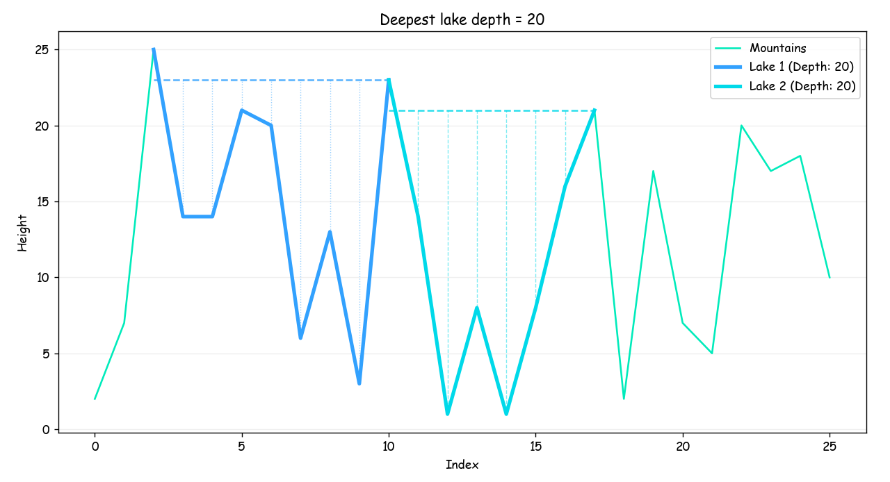

## Task 1 – Deepest Lake Detection

This script analyzes a one-dimensional terrain profile and finds the deepest lake(s).
The algorithm considers all possible basin boundaries and calculates the lake depth
based on the water level and the lowest point inside the basin.

The result is visualized using a line plot with highlighted lake areas.

