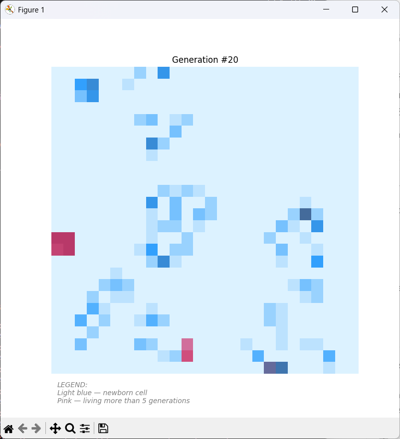

## Task 2 – Conway’s Game of Life

This program implements Conway’s Game of Life on a 26x26 grid.
The simulation follows classical rules and includes an animated visualization
with cell age–based coloring.

**Features:**
- User-defined number of evolution steps
- Color-coded cell age visualization

