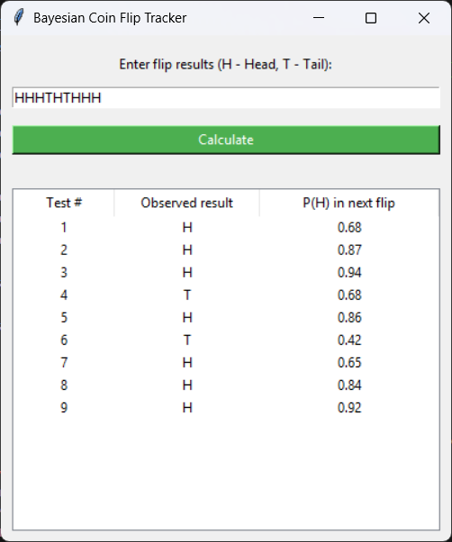

## Task 3 – Bayesian Coin Flip Estimation

This program applies Bayesian updating to estimate the probability of obtaining
a Head in the next coin flip based on previous observations.

A simple graphical user interface is provided to visualize the results.

