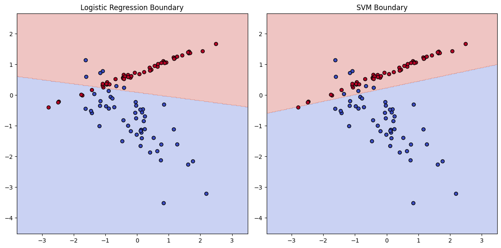
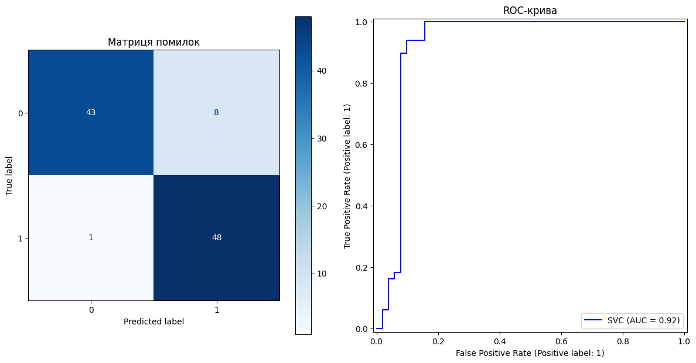

# Класифікація 🎯


```python
import numpy as np
import pandas as pd
import matplotlib.pyplot as plt
from sklearn.model_selection import train_test_split
from sklearn.datasets import make_classification
from sklearn.linear_model import LogisticRegression
from sklearn.svm import SVC
from sklearn.metrics import classification_report, confusion_matrix
from sklearn.metrics import ConfusionMatrixDisplay, RocCurveDisplay
from sklearn.preprocessing import StandardScaler
```

## Логістична регресія


```python
X, y = make_classification(n_samples=500, n_features=2,
                           n_redundant=0, n_clusters_per_class=1,
                           random_state=42)

X_train, X_test, y_train, y_test = train_test_split(X, y,
                                                    test_size=0.2,
                                                    random_state=42)

scaler = StandardScaler()
X_train_scaled = scaler.fit_transform(X_train)
X_test_scaled = scaler.transform(X_test)
```

## Метрики якості класифікації


```python
log_reg = LogisticRegression()
log_reg.fit(X_train_scaled, y_train)

print("--- Logistic Regression Results ---")
y_pred_log = log_reg.predict(X_test_scaled)
print(classification_report(y_test, y_pred_log))
```

    --- Logistic Regression Results ---
                  precision    recall  f1-score   support
    
               0       0.88      0.88      0.88        51
               1       0.88      0.88      0.88        49
    
        accuracy                           0.88       100
       macro avg       0.88      0.88      0.88       100
    weighted avg       0.88      0.88      0.88       100
    
    

## Метод опорних векторів (SVM)


```python
svm_model = SVC(kernel='linear', C=1.0, probability=True)
svm_model.fit(X_train_scaled, y_train)

print("--- SVM Results ---")
y_pred_svm = svm_model.predict(X_test_scaled)
print(classification_report(y_test, y_pred_svm))
```

    --- SVM Results ---
                  precision    recall  f1-score   support
    
               0       0.98      0.84      0.91        51
               1       0.86      0.98      0.91        49
    
        accuracy                           0.91       100
       macro avg       0.92      0.91      0.91       100
    weighted avg       0.92      0.91      0.91       100
    
    

## Візуалізація Decision Boundary


```python
def plot_decision_boundary(ax, model, X, y, title):
    h = .02 
    x_min, x_max = X[:, 0].min() - 1, X[:, 0].max() + 1
    y_min, y_max = X[:, 1].min() - 1, X[:, 1].max() + 1
    xx, yy = np.meshgrid(np.arange(x_min, x_max, h), np.arange(y_min,
                                                               y_max,
                                                               h))
    
    Z = model.predict(np.c_[xx.ravel(), yy.ravel()])
    Z = Z.reshape(xx.shape)
    
    ax.contourf(xx, yy, Z, alpha=0.3, cmap=plt.cm.coolwarm)
    ax.scatter(X[:, 0], X[:, 1], c=y, edgecolors='k',
               cmap=plt.cm.coolwarm)
    ax.set_title(title)

fig, axes = plt.subplots(1, 2, figsize=(12, 6))

plot_decision_boundary(axes[0], log_reg, X_test_scaled, y_test,
                       "Logistic Regression Boundary")
plot_decision_boundary(axes[1], svm_model, X_test_scaled, y_test, 
                       "SVM Boundary")

plt.tight_layout()
plt.show()
```


    

    


## Матриця помилок та ROC-крива


```python
print("--- Візуалізація помилок (Confusion Matrix) ---")

fig, axes = plt.subplots(1, 2, figsize=(12, 6))

ConfusionMatrixDisplay.from_estimator(svm_model, X_test_scaled, 
                                      y_test, cmap='Blues',
                                      ax=axes[0])
axes[0].set_title("Матриця помилок")

RocCurveDisplay.from_estimator(svm_model, X_test_scaled,
                               y_test, 
                               curve_kwargs={'color': 'blue'},
                               ax=axes[1])
axes[1].set_title("ROC-крива")

plt.tight_layout()
plt.show()
```

    --- Візуалізація помилок (Confusion Matrix) ---
    


    

    

