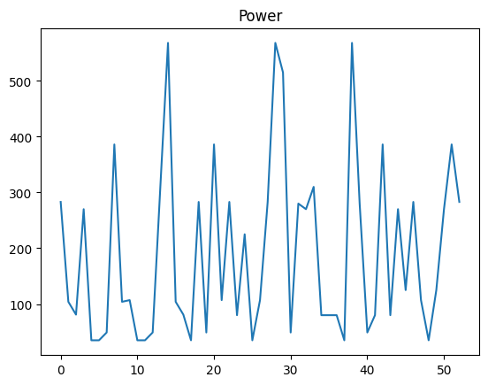
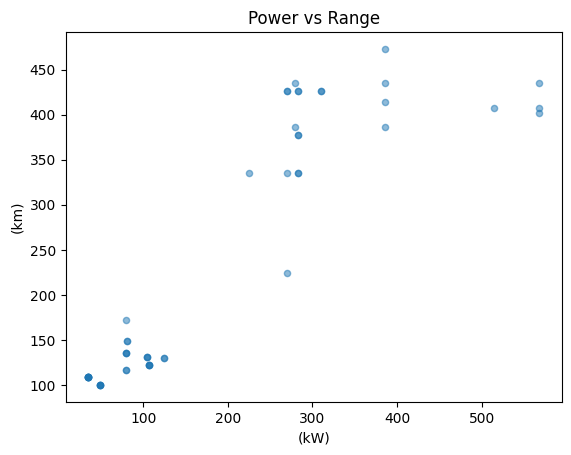
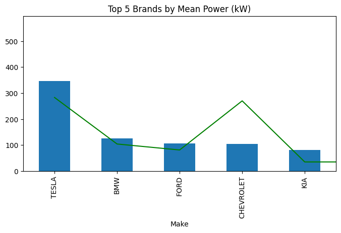

# Маніпулювання даними за допомогою Pandas 🐼

## Базові структури Pandas


```python
import pandas as pd
import numpy as np
```


```python
data = [10,20,30,40]
s1 = pd.Series(data)

print(s1)
```

    0    10
    1    20
    2    30
    3    40
    dtype: int64
    


```python
data_dict = {'Apple': 1.5, 'Banana': 0.5, 'Cherry': 3.0}
s2 = pd.Series(data_dict)

print(s2)
```

    Apple     1.5
    Banana    0.5
    Cherry    3.0
    dtype: float64
    


```python
s3 = pd.Series(5, index=['a', 'b', 'c'])

print(s3)
```

    a    5
    b    5
    c    5
    dtype: int64
    


```python
data = {
    'Name': ['Alice', 'Bob', 'Charlie'],
    'Age': [25, 30, 35],
    'City': ['New York', 'London', 'Paris']
}
df1 = pd.DataFrame(data)

print(df1)
```

          Name  Age      City
    0    Alice   25  New York
    1      Bob   30    London
    2  Charlie   35     Paris
    


```python
data_rows = [
    {'Name': 'Alice', 'Age': 25},
    {'Name': 'Bob', 'Age': 30}
]
df2 = pd.DataFrame(data_rows)

print(df2)
```

        Name  Age
    0  Alice   25
    1    Bob   30
    

## Робота з реальними файлами


```python
try:
    cars_df = pd.read_csv('cars.csv')
    print("cars.csv successfully found")
except FileNotFoundError:
    print("cars.csv not found")
```

    cars.csv successfully found
    


```python
display(cars_df.head(5))
```


<div>
<table border="1" class="dataframe">
  <thead>
    <tr style="text-align: right;">
      <th></th>
      <th>YEAR</th>
      <th>Make</th>
      <th>Model</th>
      <th>Size</th>
      <th>(kW)</th>
      <th>Unnamed: 5</th>
      <th>TYPE</th>
      <th>CITY (kWh/100 km)</th>
      <th>HWY (kWh/100 km)</th>
      <th>COMB (kWh/100 km)</th>
      <th>CITY (Le/100 km)</th>
      <th>HWY (Le/100 km)</th>
      <th>COMB (Le/100 km)</th>
      <th>(g/km)</th>
      <th>RATING</th>
      <th>(km)</th>
      <th>TIME (h)</th>
    </tr>
  </thead>
  <tbody>
    <tr>
      <th>0</th>
      <td>2012</td>
      <td>MITSUBISHI</td>
      <td>i-MiEV</td>
      <td>SUBCOMPACT</td>
      <td>49</td>
      <td>A1</td>
      <td>B</td>
      <td>16.9</td>
      <td>21.4</td>
      <td>18.7</td>
      <td>1.9</td>
      <td>2.4</td>
      <td>2.1</td>
      <td>0</td>
      <td>NaN</td>
      <td>100</td>
      <td>7</td>
    </tr>
    <tr>
      <th>1</th>
      <td>2012</td>
      <td>NISSAN</td>
      <td>LEAF</td>
      <td>MID-SIZE</td>
      <td>80</td>
      <td>A1</td>
      <td>B</td>
      <td>19.3</td>
      <td>23.0</td>
      <td>21.1</td>
      <td>2.2</td>
      <td>2.6</td>
      <td>2.4</td>
      <td>0</td>
      <td>NaN</td>
      <td>117</td>
      <td>7</td>
    </tr>
    <tr>
      <th>2</th>
      <td>2013</td>
      <td>FORD</td>
      <td>FOCUS ELECTRIC</td>
      <td>COMPACT</td>
      <td>107</td>
      <td>A1</td>
      <td>B</td>
      <td>19.0</td>
      <td>21.1</td>
      <td>20.0</td>
      <td>2.1</td>
      <td>2.4</td>
      <td>2.2</td>
      <td>0</td>
      <td>NaN</td>
      <td>122</td>
      <td>4</td>
    </tr>
    <tr>
      <th>3</th>
      <td>2013</td>
      <td>MITSUBISHI</td>
      <td>i-MiEV</td>
      <td>SUBCOMPACT</td>
      <td>49</td>
      <td>A1</td>
      <td>B</td>
      <td>16.9</td>
      <td>21.4</td>
      <td>18.7</td>
      <td>1.9</td>
      <td>2.4</td>
      <td>2.1</td>
      <td>0</td>
      <td>NaN</td>
      <td>100</td>
      <td>7</td>
    </tr>
    <tr>
      <th>4</th>
      <td>2013</td>
      <td>NISSAN</td>
      <td>LEAF</td>
      <td>MID-SIZE</td>
      <td>80</td>
      <td>A1</td>
      <td>B</td>
      <td>19.3</td>
      <td>23.0</td>
      <td>21.1</td>
      <td>2.2</td>
      <td>2.6</td>
      <td>2.4</td>
      <td>0</td>
      <td>NaN</td>
      <td>117</td>
      <td>7</td>
    </tr>
  </tbody>
</table>
</div>


```python
cars_df.info()
```

    <class 'pandas.DataFrame'>
    RangeIndex: 53 entries, 0 to 52
    Data columns (total 17 columns):
     #   Column             Non-Null Count  Dtype  
    ---  ------             --------------  -----  
     0   YEAR               53 non-null     int64  
     1   Make               53 non-null     str    
     2   Model              53 non-null     str    
     3   Size               53 non-null     str    
     4   (kW)               53 non-null     int64  
     5   Unnamed: 5         53 non-null     str    
     6   TYPE               53 non-null     str    
     7   CITY (kWh/100 km)  53 non-null     float64
     8   HWY (kWh/100 km)   53 non-null     float64
     9   COMB (kWh/100 km)  53 non-null     float64
     10  CITY (Le/100 km)   53 non-null     float64
     11  HWY (Le/100 km)    53 non-null     float64
     12  COMB (Le/100 km)   53 non-null     float64
     13  (g/km)             53 non-null     int64  
     14  RATING             19 non-null     float64
     15  (km)               53 non-null     int64  
     16  TIME (h)           53 non-null     int64  
    dtypes: float64(7), int64(5), str(5)
    memory usage: 9.0 KB
    


```python
display(cars_df.describe())
```


<div>
<table border="1" class="dataframe">
  <thead>
    <tr style="text-align: right;">
      <th></th>
      <th>YEAR</th>
      <th>(kW)</th>
      <th>CITY (kWh/100 km)</th>
      <th>HWY (kWh/100 km)</th>
      <th>COMB (kWh/100 km)</th>
      <th>CITY (Le/100 km)</th>
      <th>HWY (Le/100 km)</th>
      <th>COMB (Le/100 km)</th>
      <th>(g/km)</th>
      <th>RATING</th>
      <th>(km)</th>
      <th>TIME (h)</th>
    </tr>
  </thead>
  <tbody>
    <tr>
      <th>count</th>
      <td>53.000000</td>
      <td>53.000000</td>
      <td>53.00000</td>
      <td>53.000000</td>
      <td>53.000000</td>
      <td>53.000000</td>
      <td>53.000000</td>
      <td>53.000000</td>
      <td>53.0</td>
      <td>19.0</td>
      <td>53.000000</td>
      <td>53.000000</td>
    </tr>
    <tr>
      <th>mean</th>
      <td>2014.735849</td>
      <td>190.622642</td>
      <td>19.64717</td>
      <td>21.633962</td>
      <td>20.541509</td>
      <td>2.207547</td>
      <td>2.422642</td>
      <td>2.301887</td>
      <td>0.0</td>
      <td>10.0</td>
      <td>239.169811</td>
      <td>8.471698</td>
    </tr>
    <tr>
      <th>std</th>
      <td>1.227113</td>
      <td>155.526429</td>
      <td>3.00100</td>
      <td>1.245753</td>
      <td>1.979455</td>
      <td>0.344656</td>
      <td>0.143636</td>
      <td>0.212576</td>
      <td>0.0</td>
      <td>0.0</td>
      <td>141.426352</td>
      <td>2.991036</td>
    </tr>
    <tr>
      <th>min</th>
      <td>2012.000000</td>
      <td>35.000000</td>
      <td>15.20000</td>
      <td>18.800000</td>
      <td>16.800000</td>
      <td>1.700000</td>
      <td>2.100000</td>
      <td>1.900000</td>
      <td>0.0</td>
      <td>10.0</td>
      <td>100.000000</td>
      <td>4.000000</td>
    </tr>
    <tr>
      <th>25%</th>
      <td>2014.000000</td>
      <td>80.000000</td>
      <td>17.00000</td>
      <td>20.800000</td>
      <td>18.700000</td>
      <td>1.900000</td>
      <td>2.300000</td>
      <td>2.100000</td>
      <td>0.0</td>
      <td>10.0</td>
      <td>117.000000</td>
      <td>7.000000</td>
    </tr>
    <tr>
      <th>50%</th>
      <td>2015.000000</td>
      <td>107.000000</td>
      <td>19.00000</td>
      <td>21.700000</td>
      <td>20.000000</td>
      <td>2.100000</td>
      <td>2.400000</td>
      <td>2.200000</td>
      <td>0.0</td>
      <td>10.0</td>
      <td>135.000000</td>
      <td>8.000000</td>
    </tr>
    <tr>
      <th>75%</th>
      <td>2016.000000</td>
      <td>283.000000</td>
      <td>22.40000</td>
      <td>22.500000</td>
      <td>22.100000</td>
      <td>2.500000</td>
      <td>2.500000</td>
      <td>2.500000</td>
      <td>0.0</td>
      <td>10.0</td>
      <td>402.000000</td>
      <td>12.000000</td>
    </tr>
    <tr>
      <th>max</th>
      <td>2016.000000</td>
      <td>568.000000</td>
      <td>23.90000</td>
      <td>23.300000</td>
      <td>23.600000</td>
      <td>2.700000</td>
      <td>2.600000</td>
      <td>2.600000</td>
      <td>0.0</td>
      <td>10.0</td>
      <td>473.000000</td>
      <td>12.000000</td>
    </tr>
  </tbody>
</table>
</div>


```python
cars_df.to_csv('processed_cars.csv', index=False)
print ("processed_cars.csv successfully saved")
try:
    cars_df.to_parquet('processed_cars.parquet', index=False)
    print("processed_cars.parquet successfully saved")
except ImportError:
    print("processed_cars.parquet save error")
```

    processed_cars.csv successfully saved
    processed_cars.parquet successfully saved
    

## Дослідження даних та маніпуляція над ними


```python
print(f"Columns: {cars_df.columns.tolist()}\n")
print(f"Index: {cars_df.index}\n")
print(f"Shape: {cars_df.shape}\n")
```

    Columns: ['YEAR', 'Make', 'Model', 'Size', '(kW)', 'Unnamed: 5', 'TYPE', 'CITY (kWh/100 km)', 'HWY (kWh/100 km)', 'COMB (kWh/100 km)', 'CITY (Le/100 km)', 'HWY (Le/100 km)', 'COMB (Le/100 km)', '(g/km)', 'RATING', '(km)', 'TIME (h)']
    
    Index: RangeIndex(start=0, stop=53, step=1)
    
    Shape: (53, 17)
    
    


```python
display(cars_df.sort_values(by='(kW)', ascending=False).head())
```


<div>
<table border="1" class="dataframe">
  <thead>
    <tr style="text-align: right;">
      <th></th>
      <th>YEAR</th>
      <th>Make</th>
      <th>Model</th>
      <th>Size</th>
      <th>(kW)</th>
      <th>Unnamed: 5</th>
      <th>TYPE</th>
      <th>CITY (kWh/100 km)</th>
      <th>HWY (kWh/100 km)</th>
      <th>COMB (kWh/100 km)</th>
      <th>CITY (Le/100 km)</th>
      <th>HWY (Le/100 km)</th>
      <th>COMB (Le/100 km)</th>
      <th>(g/km)</th>
      <th>RATING</th>
      <th>(km)</th>
      <th>TIME (h)</th>
    </tr>
  </thead>
  <tbody>
    <tr>
      <th>49</th>
      <td>2016</td>
      <td>TESLA</td>
      <td>MODEL S P85D/P90D</td>
      <td>FULL-SIZE</td>
      <td>568</td>
      <td>A1</td>
      <td>B</td>
      <td>23.4</td>
      <td>21.5</td>
      <td>22.5</td>
      <td>2.6</td>
      <td>2.4</td>
      <td>2.5</td>
      <td>0</td>
      <td>10.0</td>
      <td>407</td>
      <td>12</td>
    </tr>
    <tr>
      <th>50</th>
      <td>2016</td>
      <td>TESLA</td>
      <td>MODEL S P90D (Refresh)</td>
      <td>FULL-SIZE</td>
      <td>568</td>
      <td>A1</td>
      <td>B</td>
      <td>22.9</td>
      <td>21.0</td>
      <td>22.1</td>
      <td>2.6</td>
      <td>2.4</td>
      <td>2.5</td>
      <td>0</td>
      <td>10.0</td>
      <td>435</td>
      <td>12</td>
    </tr>
    <tr>
      <th>52</th>
      <td>2016</td>
      <td>TESLA</td>
      <td>MODEL X P90D</td>
      <td>SUV - STANDARD</td>
      <td>568</td>
      <td>A1</td>
      <td>B</td>
      <td>23.6</td>
      <td>23.3</td>
      <td>23.5</td>
      <td>2.7</td>
      <td>2.6</td>
      <td>2.6</td>
      <td>0</td>
      <td>10.0</td>
      <td>402</td>
      <td>12</td>
    </tr>
    <tr>
      <th>33</th>
      <td>2015</td>
      <td>TESLA</td>
      <td>MODEL S P85D/P90D</td>
      <td>FULL-SIZE</td>
      <td>515</td>
      <td>A1</td>
      <td>B</td>
      <td>23.4</td>
      <td>21.5</td>
      <td>22.5</td>
      <td>2.6</td>
      <td>2.4</td>
      <td>2.5</td>
      <td>0</td>
      <td>NaN</td>
      <td>407</td>
      <td>12</td>
    </tr>
    <tr>
      <th>46</th>
      <td>2016</td>
      <td>TESLA</td>
      <td>MODEL S 70D</td>
      <td>FULL-SIZE</td>
      <td>386</td>
      <td>A1</td>
      <td>B</td>
      <td>20.8</td>
      <td>20.6</td>
      <td>20.7</td>
      <td>2.3</td>
      <td>2.3</td>
      <td>2.3</td>
      <td>0</td>
      <td>10.0</td>
      <td>386</td>
      <td>12</td>
    </tr>
  </tbody>
</table>
</div>


```python
display(cars_df.sort_index().head())
```


<div>
<table border="1" class="dataframe">
  <thead>
    <tr style="text-align: right;">
      <th></th>
      <th>YEAR</th>
      <th>Make</th>
      <th>Model</th>
      <th>Size</th>
      <th>(kW)</th>
      <th>Unnamed: 5</th>
      <th>TYPE</th>
      <th>CITY (kWh/100 km)</th>
      <th>HWY (kWh/100 km)</th>
      <th>COMB (kWh/100 km)</th>
      <th>CITY (Le/100 km)</th>
      <th>HWY (Le/100 km)</th>
      <th>COMB (Le/100 km)</th>
      <th>(g/km)</th>
      <th>RATING</th>
      <th>(km)</th>
      <th>TIME (h)</th>
    </tr>
  </thead>
  <tbody>
    <tr>
      <th>0</th>
      <td>2012</td>
      <td>MITSUBISHI</td>
      <td>i-MiEV</td>
      <td>SUBCOMPACT</td>
      <td>49</td>
      <td>A1</td>
      <td>B</td>
      <td>16.9</td>
      <td>21.4</td>
      <td>18.7</td>
      <td>1.9</td>
      <td>2.4</td>
      <td>2.1</td>
      <td>0</td>
      <td>NaN</td>
      <td>100</td>
      <td>7</td>
    </tr>
    <tr>
      <th>1</th>
      <td>2012</td>
      <td>NISSAN</td>
      <td>LEAF</td>
      <td>MID-SIZE</td>
      <td>80</td>
      <td>A1</td>
      <td>B</td>
      <td>19.3</td>
      <td>23.0</td>
      <td>21.1</td>
      <td>2.2</td>
      <td>2.6</td>
      <td>2.4</td>
      <td>0</td>
      <td>NaN</td>
      <td>117</td>
      <td>7</td>
    </tr>
    <tr>
      <th>2</th>
      <td>2013</td>
      <td>FORD</td>
      <td>FOCUS ELECTRIC</td>
      <td>COMPACT</td>
      <td>107</td>
      <td>A1</td>
      <td>B</td>
      <td>19.0</td>
      <td>21.1</td>
      <td>20.0</td>
      <td>2.1</td>
      <td>2.4</td>
      <td>2.2</td>
      <td>0</td>
      <td>NaN</td>
      <td>122</td>
      <td>4</td>
    </tr>
    <tr>
      <th>3</th>
      <td>2013</td>
      <td>MITSUBISHI</td>
      <td>i-MiEV</td>
      <td>SUBCOMPACT</td>
      <td>49</td>
      <td>A1</td>
      <td>B</td>
      <td>16.9</td>
      <td>21.4</td>
      <td>18.7</td>
      <td>1.9</td>
      <td>2.4</td>
      <td>2.1</td>
      <td>0</td>
      <td>NaN</td>
      <td>100</td>
      <td>7</td>
    </tr>
    <tr>
      <th>4</th>
      <td>2013</td>
      <td>NISSAN</td>
      <td>LEAF</td>
      <td>MID-SIZE</td>
      <td>80</td>
      <td>A1</td>
      <td>B</td>
      <td>19.3</td>
      <td>23.0</td>
      <td>21.1</td>
      <td>2.2</td>
      <td>2.6</td>
      <td>2.4</td>
      <td>0</td>
      <td>NaN</td>
      <td>117</td>
      <td>7</td>
    </tr>
  </tbody>
</table>
</div>


```python
cars_df.loc[0, 'YEAR'] = 2025

display(cars_df.head(1))
```


<div>
<table border="1" class="dataframe">
  <thead>
    <tr style="text-align: right;">
      <th></th>
      <th>YEAR</th>
      <th>Make</th>
      <th>Model</th>
      <th>Size</th>
      <th>(kW)</th>
      <th>Unnamed: 5</th>
      <th>TYPE</th>
      <th>CITY (kWh/100 km)</th>
      <th>HWY (kWh/100 km)</th>
      <th>COMB (kWh/100 km)</th>
      <th>CITY (Le/100 km)</th>
      <th>HWY (Le/100 km)</th>
      <th>COMB (Le/100 km)</th>
      <th>(g/km)</th>
      <th>RATING</th>
      <th>(km)</th>
      <th>TIME (h)</th>
    </tr>
  </thead>
  <tbody>
    <tr>
      <th>0</th>
      <td>2025</td>
      <td>MITSUBISHI</td>
      <td>i-MiEV</td>
      <td>SUBCOMPACT</td>
      <td>49</td>
      <td>A1</td>
      <td>B</td>
      <td>16.9</td>
      <td>21.4</td>
      <td>18.7</td>
      <td>1.9</td>
      <td>2.4</td>
      <td>2.1</td>
      <td>0</td>
      <td>NaN</td>
      <td>100</td>
      <td>7</td>
    </tr>
  </tbody>
</table>
</div>


```python
cars_df.loc[0, 'YEAR'] = 2012

display(cars_df.head(1))
```


<div>
<table border="1" class="dataframe">
  <thead>
    <tr style="text-align: right;">
      <th></th>
      <th>YEAR</th>
      <th>Make</th>
      <th>Model</th>
      <th>Size</th>
      <th>(kW)</th>
      <th>Unnamed: 5</th>
      <th>TYPE</th>
      <th>CITY (kWh/100 km)</th>
      <th>HWY (kWh/100 km)</th>
      <th>COMB (kWh/100 km)</th>
      <th>CITY (Le/100 km)</th>
      <th>HWY (Le/100 km)</th>
      <th>COMB (Le/100 km)</th>
      <th>(g/km)</th>
      <th>RATING</th>
      <th>(km)</th>
      <th>TIME (h)</th>
    </tr>
  </thead>
  <tbody>
    <tr>
      <th>0</th>
      <td>2012</td>
      <td>MITSUBISHI</td>
      <td>i-MiEV</td>
      <td>SUBCOMPACT</td>
      <td>49</td>
      <td>A1</td>
      <td>B</td>
      <td>16.9</td>
      <td>21.4</td>
      <td>18.7</td>
      <td>1.9</td>
      <td>2.4</td>
      <td>2.1</td>
      <td>0</td>
      <td>NaN</td>
      <td>100</td>
      <td>7</td>
    </tr>
  </tbody>
</table>
</div>


```python
temp_df = cars_df.drop(columns=['RATING', 'Unnamed: 5'])

display(temp_df.head(1))
```


<div>
<table border="1" class="dataframe">
  <thead>
    <tr style="text-align: right;">
      <th></th>
      <th>YEAR</th>
      <th>Make</th>
      <th>Model</th>
      <th>Size</th>
      <th>(kW)</th>
      <th>TYPE</th>
      <th>CITY (kWh/100 km)</th>
      <th>HWY (kWh/100 km)</th>
      <th>COMB (kWh/100 km)</th>
      <th>CITY (Le/100 km)</th>
      <th>HWY (Le/100 km)</th>
      <th>COMB (Le/100 km)</th>
      <th>(g/km)</th>
      <th>(km)</th>
      <th>TIME (h)</th>
    </tr>
  </thead>
  <tbody>
    <tr>
      <th>0</th>
      <td>2012</td>
      <td>MITSUBISHI</td>
      <td>i-MiEV</td>
      <td>SUBCOMPACT</td>
      <td>49</td>
      <td>B</td>
      <td>16.9</td>
      <td>21.4</td>
      <td>18.7</td>
      <td>1.9</td>
      <td>2.4</td>
      <td>2.1</td>
      <td>0</td>
      <td>100</td>
      <td>7</td>
    </tr>
  </tbody>
</table>
</div>


```python
temp_df = temp_df.drop(index=0)

display(temp_df.head(1))
```


<div>
<table border="1" class="dataframe">
  <thead>
    <tr style="text-align: right;">
      <th></th>
      <th>YEAR</th>
      <th>Make</th>
      <th>Model</th>
      <th>Size</th>
      <th>(kW)</th>
      <th>TYPE</th>
      <th>CITY (kWh/100 km)</th>
      <th>HWY (kWh/100 km)</th>
      <th>COMB (kWh/100 km)</th>
      <th>CITY (Le/100 km)</th>
      <th>HWY (Le/100 km)</th>
      <th>COMB (Le/100 km)</th>
      <th>(g/km)</th>
      <th>(km)</th>
      <th>TIME (h)</th>
    </tr>
  </thead>
  <tbody>
    <tr>
      <th>1</th>
      <td>2012</td>
      <td>NISSAN</td>
      <td>LEAF</td>
      <td>MID-SIZE</td>
      <td>80</td>
      <td>B</td>
      <td>19.3</td>
      <td>23.0</td>
      <td>21.1</td>
      <td>2.2</td>
      <td>2.6</td>
      <td>2.4</td>
      <td>0</td>
      <td>117</td>
      <td>7</td>
    </tr>
  </tbody>
</table>
</div>


## Доступ до даних та їх індексація


```python
makes = cars_df['Make']

print(makes)
```

    0     MITSUBISHI
    1         NISSAN
    2           FORD
    3     MITSUBISHI
    4         NISSAN
    5          SMART
    6          SMART
    7          TESLA
    8          TESLA
    9          TESLA
    10         TESLA
    11     CHEVROLET
    12          FORD
    13    MITSUBISHI
    14        NISSAN
    15         SMART
    16         SMART
    17         TESLA
    18         TESLA
    19         TESLA
    20           BMW
    21     CHEVROLET
    22          FORD
    23           KIA
    24    MITSUBISHI
    25        NISSAN
    26         SMART
    27         SMART
    28         TESLA
    29         TESLA
    30         TESLA
    31         TESLA
    32         TESLA
    33         TESLA
    34           BMW
    35     CHEVROLET
    36          FORD
    37           KIA
    38    MITSUBISHI
    39        NISSAN
    40        NISSAN
    41         SMART
    42         SMART
    43         TESLA
    44         TESLA
    45         TESLA
    46         TESLA
    47         TESLA
    48         TESLA
    49         TESLA
    50         TESLA
    51         TESLA
    52         TESLA
    Name: Make, dtype: str
    


```python
subset = cars_df[['YEAR', 'Make', 'Model']]

print(subset)
```

        YEAR        Make                            Model
    0   2012  MITSUBISHI                           i-MiEV
    1   2012      NISSAN                             LEAF
    2   2013        FORD                   FOCUS ELECTRIC
    3   2013  MITSUBISHI                           i-MiEV
    4   2013      NISSAN                             LEAF
    5   2013       SMART  FORTWO ELECTRIC DRIVE CABRIOLET
    6   2013       SMART      FORTWO ELECTRIC DRIVE COUPE
    7   2013       TESLA         MODEL S (40 kWh battery)
    8   2013       TESLA         MODEL S (60 kWh battery)
    9   2013       TESLA         MODEL S (85 kWh battery)
    10  2013       TESLA              MODEL S PERFORMANCE
    11  2014   CHEVROLET                         SPARK EV
    12  2014        FORD                   FOCUS ELECTRIC
    13  2014  MITSUBISHI                           i-MiEV
    14  2014      NISSAN                             LEAF
    15  2014       SMART  FORTWO ELECTRIC DRIVE CABRIOLET
    16  2014       SMART      FORTWO ELECTRIC DRIVE COUPE
    17  2014       TESLA         MODEL S (60 kWh battery)
    18  2014       TESLA         MODEL S (85 kWh battery)
    19  2014       TESLA              MODEL S PERFORMANCE
    20  2015         BMW                               i3
    21  2015   CHEVROLET                         SPARK EV
    22  2015        FORD                   FOCUS ELECTRIC
    23  2015         KIA                          SOUL EV
    24  2015  MITSUBISHI                           i-MiEV
    25  2015      NISSAN                             LEAF
    26  2015       SMART  FORTWO ELECTRIC DRIVE CABRIOLET
    27  2015       SMART      FORTWO ELECTRIC DRIVE COUPE
    28  2015       TESLA         MODEL S (60 kWh battery)
    29  2015       TESLA         MODEL S (70 kWh battery)
    30  2015       TESLA      MODEL S (85/90 kWh battery)
    31  2015       TESLA                      MODEL S 70D
    32  2015       TESLA                  MODEL S 85D/90D
    33  2015       TESLA                MODEL S P85D/P90D
    34  2016         BMW                               i3
    35  2016   CHEVROLET                         SPARK EV
    36  2016        FORD                   FOCUS ELECTRIC
    37  2016         KIA                          SOUL EV
    38  2016  MITSUBISHI                           i-MiEV
    39  2016      NISSAN            LEAF (24 kWh battery)
    40  2016      NISSAN            LEAF (30 kWh battery)
    41  2016       SMART  FORTWO ELECTRIC DRIVE CABRIOLET
    42  2016       SMART      FORTWO ELECTRIC DRIVE COUPE
    43  2016       TESLA         MODEL S (60 kWh battery)
    44  2016       TESLA         MODEL S (70 kWh battery)
    45  2016       TESLA      MODEL S (85/90 kWh battery)
    46  2016       TESLA                      MODEL S 70D
    47  2016       TESLA                  MODEL S 85D/90D
    48  2016       TESLA            MODEL S 90D (Refresh)
    49  2016       TESLA                MODEL S P85D/P90D
    50  2016       TESLA           MODEL S P90D (Refresh)
    51  2016       TESLA                      MODEL X 90D
    52  2016       TESLA                     MODEL X P90D
    


```python
print(cars_df.iloc[0])
```

    YEAR                       2012
    Make                 MITSUBISHI
    Model                    i-MiEV
    Size                 SUBCOMPACT
    (kW)                         49
    Unnamed: 5                   A1
    TYPE                          B
    CITY (kWh/100 km)          16.9
    HWY (kWh/100 km)           21.4
    COMB (kWh/100 km)          18.7
    CITY (Le/100 km)            1.9
    HWY (Le/100 km)             2.4
    COMB (Le/100 km)            2.1
    (g/km)                        0
    RATING                      NaN
    (km)                        100
    TIME (h)                      7
    Name: 0, dtype: object
    


```python
print(cars_df.iloc[4])
```

    YEAR                     2013
    Make                   NISSAN
    Model                    LEAF
    Size                 MID-SIZE
    (kW)                       80
    Unnamed: 5                 A1
    TYPE                        B
    CITY (kWh/100 km)        19.3
    HWY (kWh/100 km)         23.0
    COMB (kWh/100 km)        21.1
    CITY (Le/100 km)          2.2
    HWY (Le/100 km)           2.6
    COMB (Le/100 km)          2.4
    (g/km)                      0
    RATING                    NaN
    (km)                      117
    TIME (h)                    7
    Name: 4, dtype: object
    


```python
print(cars_df.loc[6])
```

    YEAR                                        2013
    Make                                       SMART
    Model                FORTWO ELECTRIC DRIVE COUPE
    Size                                  TWO-SEATER
    (kW)                                          35
    Unnamed: 5                                    A1
    TYPE                                           B
    CITY (kWh/100 km)                           17.2
    HWY (kWh/100 km)                            22.5
    COMB (kWh/100 km)                           19.6
    CITY (Le/100 km)                             1.9
    HWY (Le/100 km)                              2.5
    COMB (Le/100 km)                             2.2
    (g/km)                                         0
    RATING                                       NaN
    (km)                                         109
    TIME (h)                                       8
    Name: 6, dtype: object
    


```python
print(cars_df.loc[5, 'Model'])
```

    FORTWO ELECTRIC DRIVE CABRIOLET
    


```python
np.random.seed(42)
indexes = np.arange(cars_df.shape[0])
np.random.shuffle(indexes)
cars_df.index = indexes
cars_df.sort_index(inplace=True)
```


```python
cars_df[cars_df['Make'].isin(['BMW', 'Audi'])]
```


<div>
<table border="1" class="dataframe">
  <thead>
    <tr style="text-align: right;">
      <th></th>
      <th>YEAR</th>
      <th>Make</th>
      <th>Model</th>
      <th>Size</th>
      <th>(kW)</th>
      <th>Unnamed: 5</th>
      <th>TYPE</th>
      <th>CITY (kWh/100 km)</th>
      <th>HWY (kWh/100 km)</th>
      <th>COMB (kWh/100 km)</th>
      <th>CITY (Le/100 km)</th>
      <th>HWY (Le/100 km)</th>
      <th>COMB (Le/100 km)</th>
      <th>(g/km)</th>
      <th>RATING</th>
      <th>(km)</th>
      <th>TIME (h)</th>
    </tr>
  </thead>
  <tbody>
    <tr>
      <th>45</th>
      <td>2016</td>
      <td>BMW</td>
      <td>i3</td>
      <td>SUBCOMPACT</td>
      <td>125</td>
      <td>A1</td>
      <td>B</td>
      <td>15.2</td>
      <td>18.8</td>
      <td>16.8</td>
      <td>1.7</td>
      <td>2.1</td>
      <td>1.9</td>
      <td>0</td>
      <td>10.0</td>
      <td>130</td>
      <td>4</td>
    </tr>
    <tr>
      <th>49</th>
      <td>2015</td>
      <td>BMW</td>
      <td>i3</td>
      <td>SUBCOMPACT</td>
      <td>125</td>
      <td>A1</td>
      <td>B</td>
      <td>15.2</td>
      <td>18.8</td>
      <td>16.8</td>
      <td>1.7</td>
      <td>2.1</td>
      <td>1.9</td>
      <td>0</td>
      <td>NaN</td>
      <td>130</td>
      <td>4</td>
    </tr>
  </tbody>
</table>
</div>


```python
cars_df[cars_df['Model'].str.contains('X')]
```


<div>
<table border="1" class="dataframe">
  <thead>
    <tr style="text-align: right;">
      <th></th>
      <th>YEAR</th>
      <th>Make</th>
      <th>Model</th>
      <th>Size</th>
      <th>(kW)</th>
      <th>Unnamed: 5</th>
      <th>TYPE</th>
      <th>CITY (kWh/100 km)</th>
      <th>HWY (kWh/100 km)</th>
      <th>COMB (kWh/100 km)</th>
      <th>CITY (Le/100 km)</th>
      <th>HWY (Le/100 km)</th>
      <th>COMB (Le/100 km)</th>
      <th>(g/km)</th>
      <th>RATING</th>
      <th>(km)</th>
      <th>TIME (h)</th>
    </tr>
  </thead>
  <tbody>
    <tr>
      <th>38</th>
      <td>2016</td>
      <td>TESLA</td>
      <td>MODEL X P90D</td>
      <td>SUV - STANDARD</td>
      <td>568</td>
      <td>A1</td>
      <td>B</td>
      <td>23.6</td>
      <td>23.3</td>
      <td>23.5</td>
      <td>2.7</td>
      <td>2.6</td>
      <td>2.6</td>
      <td>0</td>
      <td>10.0</td>
      <td>402</td>
      <td>12</td>
    </tr>
    <tr>
      <th>51</th>
      <td>2016</td>
      <td>TESLA</td>
      <td>MODEL X 90D</td>
      <td>SUV - STANDARD</td>
      <td>386</td>
      <td>A1</td>
      <td>B</td>
      <td>23.2</td>
      <td>22.2</td>
      <td>22.7</td>
      <td>2.6</td>
      <td>2.5</td>
      <td>2.6</td>
      <td>0</td>
      <td>10.0</td>
      <td>414</td>
      <td>12</td>
    </tr>
  </tbody>
</table>
</div>


## Фільтрація та вибірка даних


```python
tesla_cars = cars_df[cars_df['Make'] == 'TESLA']

display(tesla_cars.head())
```


<div>
<table border="1" class="dataframe">
  <thead>
    <tr style="text-align: right;">
      <th></th>
      <th>YEAR</th>
      <th>Make</th>
      <th>Model</th>
      <th>Size</th>
      <th>(kW)</th>
      <th>Unnamed: 5</th>
      <th>TYPE</th>
      <th>CITY (kWh/100 km)</th>
      <th>HWY (kWh/100 km)</th>
      <th>COMB (kWh/100 km)</th>
      <th>CITY (Le/100 km)</th>
      <th>HWY (Le/100 km)</th>
      <th>COMB (Le/100 km)</th>
      <th>(g/km)</th>
      <th>RATING</th>
      <th>(km)</th>
      <th>TIME (h)</th>
    </tr>
  </thead>
  <tbody>
    <tr>
      <th>0</th>
      <td>2015</td>
      <td>TESLA</td>
      <td>MODEL S (60 kWh battery)</td>
      <td>FULL-SIZE</td>
      <td>283</td>
      <td>A1</td>
      <td>B</td>
      <td>22.2</td>
      <td>21.7</td>
      <td>21.9</td>
      <td>2.5</td>
      <td>2.4</td>
      <td>2.5</td>
      <td>0</td>
      <td>NaN</td>
      <td>335</td>
      <td>10</td>
    </tr>
    <tr>
      <th>3</th>
      <td>2013</td>
      <td>TESLA</td>
      <td>MODEL S (60 kWh battery)</td>
      <td>FULL-SIZE</td>
      <td>270</td>
      <td>A1</td>
      <td>B</td>
      <td>22.2</td>
      <td>21.7</td>
      <td>21.9</td>
      <td>2.5</td>
      <td>2.4</td>
      <td>2.5</td>
      <td>0</td>
      <td>NaN</td>
      <td>335</td>
      <td>10</td>
    </tr>
    <tr>
      <th>7</th>
      <td>2016</td>
      <td>TESLA</td>
      <td>MODEL S 85D/90D</td>
      <td>FULL-SIZE</td>
      <td>386</td>
      <td>A1</td>
      <td>B</td>
      <td>22.0</td>
      <td>19.8</td>
      <td>21.0</td>
      <td>2.5</td>
      <td>2.2</td>
      <td>2.4</td>
      <td>0</td>
      <td>10.0</td>
      <td>435</td>
      <td>12</td>
    </tr>
    <tr>
      <th>13</th>
      <td>2013</td>
      <td>TESLA</td>
      <td>MODEL S PERFORMANCE</td>
      <td>FULL-SIZE</td>
      <td>310</td>
      <td>A1</td>
      <td>B</td>
      <td>23.9</td>
      <td>23.2</td>
      <td>23.6</td>
      <td>2.7</td>
      <td>2.6</td>
      <td>2.6</td>
      <td>0</td>
      <td>NaN</td>
      <td>426</td>
      <td>12</td>
    </tr>
    <tr>
      <th>14</th>
      <td>2016</td>
      <td>TESLA</td>
      <td>MODEL S P85D/P90D</td>
      <td>FULL-SIZE</td>
      <td>568</td>
      <td>A1</td>
      <td>B</td>
      <td>23.4</td>
      <td>21.5</td>
      <td>22.5</td>
      <td>2.6</td>
      <td>2.4</td>
      <td>2.5</td>
      <td>0</td>
      <td>10.0</td>
      <td>407</td>
      <td>12</td>
    </tr>
  </tbody>
</table>
</div>


```python
tesla_2016 = cars_df[(cars_df['Make'] == 'TESLA') & (cars_df['YEAR'] == 2016)]

display(tesla_2016.head())
```


<div>
<table border="1" class="dataframe">
  <thead>
    <tr style="text-align: right;">
      <th></th>
      <th>YEAR</th>
      <th>Make</th>
      <th>Model</th>
      <th>Size</th>
      <th>(kW)</th>
      <th>Unnamed: 5</th>
      <th>TYPE</th>
      <th>CITY (kWh/100 km)</th>
      <th>HWY (kWh/100 km)</th>
      <th>COMB (kWh/100 km)</th>
      <th>CITY (Le/100 km)</th>
      <th>HWY (Le/100 km)</th>
      <th>COMB (Le/100 km)</th>
      <th>(g/km)</th>
      <th>RATING</th>
      <th>(km)</th>
      <th>TIME (h)</th>
    </tr>
  </thead>
  <tbody>
    <tr>
      <th>7</th>
      <td>2016</td>
      <td>TESLA</td>
      <td>MODEL S 85D/90D</td>
      <td>FULL-SIZE</td>
      <td>386</td>
      <td>A1</td>
      <td>B</td>
      <td>22.0</td>
      <td>19.8</td>
      <td>21.0</td>
      <td>2.5</td>
      <td>2.2</td>
      <td>2.4</td>
      <td>0</td>
      <td>10.0</td>
      <td>435</td>
      <td>12</td>
    </tr>
    <tr>
      <th>14</th>
      <td>2016</td>
      <td>TESLA</td>
      <td>MODEL S P85D/P90D</td>
      <td>FULL-SIZE</td>
      <td>568</td>
      <td>A1</td>
      <td>B</td>
      <td>23.4</td>
      <td>21.5</td>
      <td>22.5</td>
      <td>2.6</td>
      <td>2.4</td>
      <td>2.5</td>
      <td>0</td>
      <td>10.0</td>
      <td>407</td>
      <td>12</td>
    </tr>
    <tr>
      <th>18</th>
      <td>2016</td>
      <td>TESLA</td>
      <td>MODEL S (70 kWh battery)</td>
      <td>FULL-SIZE</td>
      <td>283</td>
      <td>A1</td>
      <td>B</td>
      <td>23.8</td>
      <td>23.2</td>
      <td>23.6</td>
      <td>2.7</td>
      <td>2.6</td>
      <td>2.6</td>
      <td>0</td>
      <td>10.0</td>
      <td>377</td>
      <td>12</td>
    </tr>
    <tr>
      <th>20</th>
      <td>2016</td>
      <td>TESLA</td>
      <td>MODEL S 70D</td>
      <td>FULL-SIZE</td>
      <td>386</td>
      <td>A1</td>
      <td>B</td>
      <td>20.8</td>
      <td>20.6</td>
      <td>20.7</td>
      <td>2.3</td>
      <td>2.3</td>
      <td>2.3</td>
      <td>0</td>
      <td>10.0</td>
      <td>386</td>
      <td>12</td>
    </tr>
    <tr>
      <th>22</th>
      <td>2016</td>
      <td>TESLA</td>
      <td>MODEL S (60 kWh battery)</td>
      <td>FULL-SIZE</td>
      <td>283</td>
      <td>A1</td>
      <td>B</td>
      <td>22.2</td>
      <td>21.7</td>
      <td>21.9</td>
      <td>2.5</td>
      <td>2.4</td>
      <td>2.5</td>
      <td>0</td>
      <td>10.0</td>
      <td>335</td>
      <td>10</td>
    </tr>
  </tbody>
</table>
</div>


```python
mask = (cars_df['Make'] == 'FORD') & (cars_df['YEAR'] == 2014)

print(mask.head())
print(f"Column where the condition is met - 25: {mask.loc[25]}" )
```

    0    False
    1    False
    2    False
    3    False
    4    False
    dtype: bool
    Column where the condition is met - 25: False
    


```python
mask2 = (cars_df['Make'] == 'CHEVROLET') | (cars_df['YEAR'] == 2016)

print(mask2.head())
```

    0    False
    1     True
    2     True
    3    False
    4    False
    dtype: bool
    


```python
brands = ['BMW', 'KIA']
display(cars_df[cars_df['Make'].isin(brands)].head())
```


<div>
<table border="1" class="dataframe">
  <thead>
    <tr style="text-align: right;">
      <th></th>
      <th>YEAR</th>
      <th>Make</th>
      <th>Model</th>
      <th>Size</th>
      <th>(kW)</th>
      <th>Unnamed: 5</th>
      <th>TYPE</th>
      <th>CITY (kWh/100 km)</th>
      <th>HWY (kWh/100 km)</th>
      <th>COMB (kWh/100 km)</th>
      <th>CITY (Le/100 km)</th>
      <th>HWY (Le/100 km)</th>
      <th>COMB (Le/100 km)</th>
      <th>(g/km)</th>
      <th>RATING</th>
      <th>(km)</th>
      <th>TIME (h)</th>
    </tr>
  </thead>
  <tbody>
    <tr>
      <th>2</th>
      <td>2016</td>
      <td>KIA</td>
      <td>SOUL EV</td>
      <td>STATION WAGON - SMALL</td>
      <td>81</td>
      <td>A1</td>
      <td>B</td>
      <td>17.5</td>
      <td>22.7</td>
      <td>19.9</td>
      <td>2.0</td>
      <td>2.6</td>
      <td>2.2</td>
      <td>0</td>
      <td>10.0</td>
      <td>149</td>
      <td>4</td>
    </tr>
    <tr>
      <th>16</th>
      <td>2015</td>
      <td>KIA</td>
      <td>SOUL EV</td>
      <td>STATION WAGON - SMALL</td>
      <td>81</td>
      <td>A1</td>
      <td>B</td>
      <td>17.5</td>
      <td>22.7</td>
      <td>19.9</td>
      <td>2.0</td>
      <td>2.6</td>
      <td>2.2</td>
      <td>0</td>
      <td>NaN</td>
      <td>149</td>
      <td>4</td>
    </tr>
    <tr>
      <th>45</th>
      <td>2016</td>
      <td>BMW</td>
      <td>i3</td>
      <td>SUBCOMPACT</td>
      <td>125</td>
      <td>A1</td>
      <td>B</td>
      <td>15.2</td>
      <td>18.8</td>
      <td>16.8</td>
      <td>1.7</td>
      <td>2.1</td>
      <td>1.9</td>
      <td>0</td>
      <td>10.0</td>
      <td>130</td>
      <td>4</td>
    </tr>
    <tr>
      <th>49</th>
      <td>2015</td>
      <td>BMW</td>
      <td>i3</td>
      <td>SUBCOMPACT</td>
      <td>125</td>
      <td>A1</td>
      <td>B</td>
      <td>15.2</td>
      <td>18.8</td>
      <td>16.8</td>
      <td>1.7</td>
      <td>2.1</td>
      <td>1.9</td>
      <td>0</td>
      <td>NaN</td>
      <td>130</td>
      <td>4</td>
    </tr>
  </tbody>
</table>
</div>


```python
display(cars_df[cars_df['Model'].str.contains('battery', case=False)].head())
```


<div>
<table border="1" class="dataframe">
  <thead>
    <tr style="text-align: right;">
      <th></th>
      <th>YEAR</th>
      <th>Make</th>
      <th>Model</th>
      <th>Size</th>
      <th>(kW)</th>
      <th>Unnamed: 5</th>
      <th>TYPE</th>
      <th>CITY (kWh/100 km)</th>
      <th>HWY (kWh/100 km)</th>
      <th>COMB (kWh/100 km)</th>
      <th>CITY (Le/100 km)</th>
      <th>HWY (Le/100 km)</th>
      <th>COMB (Le/100 km)</th>
      <th>(g/km)</th>
      <th>RATING</th>
      <th>(km)</th>
      <th>TIME (h)</th>
    </tr>
  </thead>
  <tbody>
    <tr>
      <th>0</th>
      <td>2015</td>
      <td>TESLA</td>
      <td>MODEL S (60 kWh battery)</td>
      <td>FULL-SIZE</td>
      <td>283</td>
      <td>A1</td>
      <td>B</td>
      <td>22.2</td>
      <td>21.7</td>
      <td>21.9</td>
      <td>2.5</td>
      <td>2.4</td>
      <td>2.5</td>
      <td>0</td>
      <td>NaN</td>
      <td>335</td>
      <td>10</td>
    </tr>
    <tr>
      <th>3</th>
      <td>2013</td>
      <td>TESLA</td>
      <td>MODEL S (60 kWh battery)</td>
      <td>FULL-SIZE</td>
      <td>270</td>
      <td>A1</td>
      <td>B</td>
      <td>22.2</td>
      <td>21.7</td>
      <td>21.9</td>
      <td>2.5</td>
      <td>2.4</td>
      <td>2.5</td>
      <td>0</td>
      <td>NaN</td>
      <td>335</td>
      <td>10</td>
    </tr>
    <tr>
      <th>18</th>
      <td>2016</td>
      <td>TESLA</td>
      <td>MODEL S (70 kWh battery)</td>
      <td>FULL-SIZE</td>
      <td>283</td>
      <td>A1</td>
      <td>B</td>
      <td>23.8</td>
      <td>23.2</td>
      <td>23.6</td>
      <td>2.7</td>
      <td>2.6</td>
      <td>2.6</td>
      <td>0</td>
      <td>10.0</td>
      <td>377</td>
      <td>12</td>
    </tr>
    <tr>
      <th>22</th>
      <td>2016</td>
      <td>TESLA</td>
      <td>MODEL S (60 kWh battery)</td>
      <td>FULL-SIZE</td>
      <td>283</td>
      <td>A1</td>
      <td>B</td>
      <td>22.2</td>
      <td>21.7</td>
      <td>21.9</td>
      <td>2.5</td>
      <td>2.4</td>
      <td>2.5</td>
      <td>0</td>
      <td>10.0</td>
      <td>335</td>
      <td>10</td>
    </tr>
    <tr>
      <th>23</th>
      <td>2016</td>
      <td>NISSAN</td>
      <td>LEAF (30 kWh battery)</td>
      <td>MID-SIZE</td>
      <td>80</td>
      <td>A1</td>
      <td>B</td>
      <td>17.0</td>
      <td>20.7</td>
      <td>18.6</td>
      <td>1.9</td>
      <td>2.3</td>
      <td>2.1</td>
      <td>0</td>
      <td>10.0</td>
      <td>172</td>
      <td>6</td>
    </tr>
  </tbody>
</table>
</div>


## Об’єднання та агрегація даних


```python
df_a = pd.DataFrame({'ID': [1, 2], 'Val': ['A1', 'A2']})
df_b = pd.DataFrame({'ID': [3, 4], 'Val': ['B1', 'B2']})

display(df_a)
display(df_b)
```


<div>
<table border="1" class="dataframe">
  <thead>
    <tr style="text-align: right;">
      <th></th>
      <th>ID</th>
      <th>Val</th>
    </tr>
  </thead>
  <tbody>
    <tr>
      <th>0</th>
      <td>1</td>
      <td>A1</td>
    </tr>
    <tr>
      <th>1</th>
      <td>2</td>
      <td>A2</td>
    </tr>
  </tbody>
</table>
</div>


<div>
<table border="1" class="dataframe">
  <thead>
    <tr style="text-align: right;">
      <th></th>
      <th>ID</th>
      <th>Val</th>
    </tr>
  </thead>
  <tbody>
    <tr>
      <th>0</th>
      <td>3</td>
      <td>B1</td>
    </tr>
    <tr>
      <th>1</th>
      <td>4</td>
      <td>B2</td>
    </tr>
  </tbody>
</table>
</div>


```python
pd.concat([df_a, df_b], axis=0)
```


<div>
<table border="1" class="dataframe">
  <thead>
    <tr style="text-align: right;">
      <th></th>
      <th>ID</th>
      <th>Val</th>
    </tr>
  </thead>
  <tbody>
    <tr>
      <th>0</th>
      <td>1</td>
      <td>A1</td>
    </tr>
    <tr>
      <th>1</th>
      <td>2</td>
      <td>A2</td>
    </tr>
    <tr>
      <th>0</th>
      <td>3</td>
      <td>B1</td>
    </tr>
    <tr>
      <th>1</th>
      <td>4</td>
      <td>B2</td>
    </tr>
  </tbody>
</table>
</div>


```python
pd.concat([df_a, df_b], axis=1)
```


<div>
<table border="1" class="dataframe">
  <thead>
    <tr style="text-align: right;">
      <th></th>
      <th>ID</th>
      <th>Val</th>
      <th>ID</th>
      <th>Val</th>
    </tr>
  </thead>
  <tbody>
    <tr>
      <th>0</th>
      <td>1</td>
      <td>A1</td>
      <td>3</td>
      <td>B1</td>
    </tr>
    <tr>
      <th>1</th>
      <td>2</td>
      <td>A2</td>
      <td>4</td>
      <td>B2</td>
    </tr>
  </tbody>
</table>
</div>


```python
left = pd.DataFrame({'key': ['K0', 'K1', 'K1', 'K3'], 'A': ['A0', 'A1', 'A2', 'A3']})
right = pd.DataFrame({'key': ['K0', 'K1', 'K1', 'K2'], 'B': ['B0', 'B1', 'B2', 'B3']})

pd.merge(left, right, on='key', how='inner')
```


<div>
<table border="1" class="dataframe">
  <thead>
    <tr style="text-align: right;">
      <th></th>
      <th>key</th>
      <th>A</th>
      <th>B</th>
    </tr>
  </thead>
  <tbody>
    <tr>
      <th>0</th>
      <td>K0</td>
      <td>A0</td>
      <td>B0</td>
    </tr>
    <tr>
      <th>1</th>
      <td>K1</td>
      <td>A1</td>
      <td>B1</td>
    </tr>
    <tr>
      <th>2</th>
      <td>K1</td>
      <td>A1</td>
      <td>B2</td>
    </tr>
    <tr>
      <th>3</th>
      <td>K1</td>
      <td>A2</td>
      <td>B1</td>
    </tr>
    <tr>
      <th>4</th>
      <td>K1</td>
      <td>A2</td>
      <td>B2</td>
    </tr>
  </tbody>
</table>
</div>


```python
avg_kw = cars_df.groupby('Make')['(km)'].mean()

print(avg_kw)
```

    Make
    BMW           130.000000
    CHEVROLET     131.000000
    FORD          122.000000
    KIA           149.000000
    MITSUBISHI    100.000000
    NISSAN        135.166667
    SMART         109.000000
    TESLA         393.652174
    Name: (km), dtype: float64
    


```python
multi_agg = cars_df.groupby('Make')['(km)'].agg(['mean', 'max', 'count'])

print(multi_agg)
```

                      mean  max  count
    Make                              
    BMW         130.000000  130      2
    CHEVROLET   131.000000  131      3
    FORD        122.000000  122      4
    KIA         149.000000  149      2
    MITSUBISHI  100.000000  100      5
    NISSAN      135.166667  172      6
    SMART       109.000000  109      8
    TESLA       393.652174  473     23
    

## Очищення та аналіз даних


```python
print(cars_df.isna().sum())
```

    YEAR                  0
    Make                  0
    Model                 0
    Size                  0
    (kW)                  0
    Unnamed: 5            0
    TYPE                  0
    CITY (kWh/100 km)     0
    HWY (kWh/100 km)      0
    COMB (kWh/100 km)     0
    CITY (Le/100 km)      0
    HWY (Le/100 km)       0
    COMB (Le/100 km)      0
    (g/km)                0
    RATING               34
    (km)                  0
    TIME (h)              0
    dtype: int64
    


```python
clean_df = cars_df.dropna()

print(f"Кількість рядків до видалення пустих значень: {cars_df["RATING"].size}")
print(f"Кількість рядків після видалення пустих значень: {clean_df["RATING"].size}")
```

    Кількість рядків до видалення пустих значень: 53
    Кількість рядків після видалення пустих значень: 19
    


```python
filled_df = cars_df.fillna(999)

display(filled_df["RATING"].head())
```


    0    999.0
    1     10.0
    2     10.0
    3    999.0
    4    999.0
    Name: RATING, dtype: float64


```python
students = pd.DataFrame({
    'student_id': [101, 102, 101],
    'name': ['Alice', 'Bob', 'Alice'],
    'score': [85, 92, 85]
})
print(f"Кількість дублікатів в таблиці: {students.duplicated().sum()}\n")
print(students, "\n")
print(students.drop_duplicates())
```

    Кількість дублікатів в таблиці: 1
    
       student_id   name  score
    0         101  Alice     85
    1         102    Bob     92
    2         101  Alice     85 
    
       student_id   name  score
    0         101  Alice     85
    1         102    Bob     92
    


```python
series_nan = pd.Series([1, np.nan, np.nan, 4])
print(series_nan, "\n")

series_fillna = series_nan.fillna(0)
print(series_fillna, "\n")

series_interpolate = series_nan.interpolate()
print(series_interpolate, "\n")

series_ffill = series_nan.ffill()
print(series_ffill)
```

    0    1.0
    1    NaN
    2    NaN
    3    4.0
    dtype: float64 
    
    0    1.0
    1    0.0
    2    0.0
    3    4.0
    dtype: float64 
    
    0    1.0
    1    2.0
    2    3.0
    3    4.0
    dtype: float64 
    
    0    1.0
    1    1.0
    2    1.0
    3    4.0
    dtype: float64
    

## Візуалізація даних


```python
import timeit
```


```python
large_df = pd.DataFrame({'nums': range(1_000_000)})

apply_time = timeit.timeit(
    lambda: large_df['nums'].apply(lambda x: x + 10),
    number=10
)

vector_time = timeit.timeit(
    lambda: large_df['nums'] + 10,
    number=10
)

print("apply:", apply_time)
print("vectorized:", vector_time)
```

    apply: 7.88015430001542
    vectorized: 0.08485809992998838
    


```python
clean_chain = (
    cars_df
    .query("Make == 'TESLA'")
    .assign(power_per_km = lambda df: df['(kW)'] / df['(km)'])
    .sort_values(by='power_per_km', ascending=False)
    [['Make', 'Model', 'power_per_km']]
    .head(3)
)

display(clean_chain)
```


<div>
<table border="1" class="dataframe">
  <thead>
    <tr style="text-align: right;">
      <th></th>
      <th>Make</th>
      <th>Model</th>
      <th>power_per_km</th>
    </tr>
  </thead>
  <tbody>
    <tr>
      <th>38</th>
      <td>TESLA</td>
      <td>MODEL X P90D</td>
      <td>1.412935</td>
    </tr>
    <tr>
      <th>14</th>
      <td>TESLA</td>
      <td>MODEL S P85D/P90D</td>
      <td>1.395577</td>
    </tr>
    <tr>
      <th>28</th>
      <td>TESLA</td>
      <td>MODEL S P90D (Refresh)</td>
      <td>1.305747</td>
    </tr>
  </tbody>
</table>
</div>


```python
df_wide = pd.DataFrame({'City': ['London'], '2022': [15], '2023': [18]})
df_long = df_wide.melt(id_vars='City', var_name='Year', value_name='Temp')

print(df_wide, "\n")
print(df_long)
```

         City  2022  2023
    0  London    15    18 
    
         City  Year  Temp
    0  London  2022    15
    1  London  2023    18
    


```python
df_dates = pd.DataFrame({'date': ['2024-01-01']})
df_dates['date'] = pd.to_datetime(df_dates['date'])
df_dates['day'] = df_dates['date'].dt.day_name()

print(df_dates)
```

            date     day
    0 2024-01-01  Monday
    


```python
numeric_df = cars_df[['(kW)', '(km)', 'TIME (h)']]
numeric_df.head().style.background_gradient(cmap='YlGn')
```


<table id="T_258bb">
  <thead>
    <tr>
      <th class="blank level0" >&nbsp;</th>
      <th id="T_258bb_level0_col0" class="col_heading level0 col0" >(kW)</th>
      <th id="T_258bb_level0_col1" class="col_heading level0 col1" >(km)</th>
      <th id="T_258bb_level0_col2" class="col_heading level0 col2" >TIME (h)</th>
    </tr>
  </thead>
  <tbody>
    <tr>
      <th id="T_258bb_level0_row0" class="row_heading level0 row0" >0</th>
      <td id="T_258bb_row0_col0" class="data row0 col0" >283</td>
      <td id="T_258bb_row0_col1" class="data row0 col1" >335</td>
      <td id="T_258bb_row0_col2" class="data row0 col2" >10</td>
    </tr>
    <tr>
      <th id="T_258bb_level0_row1" class="row_heading level0 row1" >1</th>
      <td id="T_258bb_row1_col0" class="data row1 col0" >104</td>
      <td id="T_258bb_row1_col1" class="data row1 col1" >131</td>
      <td id="T_258bb_row1_col2" class="data row1 col2" >7</td>
    </tr>
    <tr>
      <th id="T_258bb_level0_row2" class="row_heading level0 row2" >2</th>
      <td id="T_258bb_row2_col0" class="data row2 col0" >81</td>
      <td id="T_258bb_row2_col1" class="data row2 col1" >149</td>
      <td id="T_258bb_row2_col2" class="data row2 col2" >4</td>
    </tr>
    <tr>
      <th id="T_258bb_level0_row3" class="row_heading level0 row3" >3</th>
      <td id="T_258bb_row3_col0" class="data row3 col0" >270</td>
      <td id="T_258bb_row3_col1" class="data row3 col1" >335</td>
      <td id="T_258bb_row3_col2" class="data row3 col2" >10</td>
    </tr>
    <tr>
      <th id="T_258bb_level0_row4" class="row_heading level0 row4" >4</th>
      <td id="T_258bb_row4_col0" class="data row4 col0" >35</td>
      <td id="T_258bb_row4_col1" class="data row4 col1" >109</td>
      <td id="T_258bb_row4_col2" class="data row4 col2" >8</td>
    </tr>
  </tbody>
</table>


```python
cars_df['(kW)'].plot(title='Power')
```


    <Axes: title={'center': 'Power'}>


    

    


```python
cars_df.plot.scatter(x='(kW)', y='(km)', title='Power vs Range', alpha=0.5)
```


    <Axes: title={'center': 'Power vs Range'}, xlabel='(kW)', ylabel='(km)'>


    

    


```python
cars_df['(kW)'].plot(title='Power (kW) Distribution', color='green')

avg_kw = cars_df.groupby('Make')['(kW)'].mean().sort_values(ascending=False).head(5)
avg_kw.plot.bar(title='Top 5 Brands by Mean Power (kW)', figsize=(8, 4))
```


    <Axes: title={'center': 'Top 5 Brands by Mean Power (kW)'}, xlabel='Make'>


    

    

